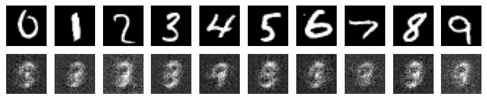
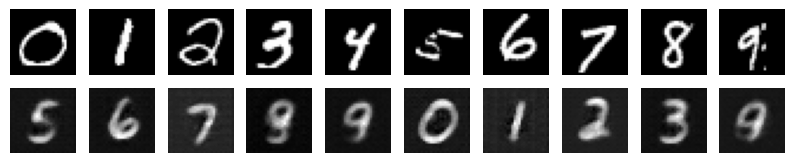

# MNIST Img2Img

## Abstract

One of the core tasks in computer vision is image-to-image translation, which is the conversion of an input image into an equivalent output image. Although Generative Adversarial Networks (GANs) have been extensively employed for these kinds of tasks, this study investigates a different strategy that makes use of the U-Net architecture. Because U-Net can capture both local and global information, it has demonstrated promising results in a variety of image-to-image translation applications. Originally, U-Net was proposed for biological image segmentation. The purpose of this study is to examine U-Net's efficacy in image-to-image generation in the absence of GANs.

## Methodology

### Wasserstein Loss

When training our U-Net model, we use the Wasserstein loss function as opposed to more conventional ones like Mean Squared Error (MSE) or Cross-Entropy Loss. The difference between the intended distribution and the distribution produced by the model is measured by the Wasserstein distance, also called Earth Mover's Distance (EMD). The model learns to generate outputs that are closer to the ground truth images by lowering the Wasserstein distance, which enhances the quality of image production.

### RAdam

To train the U-Net model, we use the Rectified Adam (RAdam) optimizer, which has a learning rate of 0.01. RAdam is an optimizer that combines adaptive learning rates with parameter update variance correction to produce a more stable and effective optimization. Our goal with RAdam is to improve the model's performance in learning the image-to-image translation task and hasten the training process' convergence.

### Architecture Modifications

In this study, we significantly alter the U-Net design that is standard. In particular, we eliminate the pooling layers that are usually used in U-Net's contractual approach. We gradually downsample the feature maps by using strided convolutions in convolutional layers instead of pooling.

## Dataset

For this experiment, we utilized the MNIST dataset, a widely used benchmark dataset in the field of computer vision. MNIST consists of grayscale images of handwritten digits (0-9), each of size 28x28 pixels. We formulated an image-to-image translation task using MNIST, where specific digits served as input images, and corresponding digits were designated as target output images. For instance, images of digit "0" were used as input, with digit "5" designated as the target output. Similarly, images of digit "1" served as input, and digit "6" was designated as the target output, and so forth. This setup allowed us to evaluate the performance of our U-Net architecture in translating input digits to their corresponding target digits.

## Experimental Results

### Training Process with Wasserstein Loss

The training process of the U-Net model using the Wasserstein loss function was monitored over 30 epochs. During each epoch, the model learned to minimize the Wasserstein distance between the generated images and the ground truth target images. The training process involved iteratively updating the model parameters using the RAdam optimizer with a fixed learning rate of 0.01.

    
    <i>Figure 1: 0-30 Epochs with Wasserstein Loss</i>

The training procedure from epoch 0 through epoch 30 is depicted in the above image. Since the model's predictions are far from the actual images, the Wasserstein loss is comparatively significant at the start of the training process (epoch 0). But as training goes on, the Wasserstein loss progressively drops, showing that the model is getting better at producing realistic and accurate images.

    
    <i>Figure 2: Result afert 1 Epoch of Training with Wasserstein Loss</i>

    
    <i>Figure 3: Result afert 30 Epochs of Training with Wasserstein Loss</i>

The Wasserstein loss approaches a relatively low value by epoch 30, indicating that the U-Net model has mastered the ability to generate images that closely resemble the target images in terms of quality. This illustrates how well the Wasserstein loss function works to direct training and provide desired results in image-to-image translation challenges.

## Conclusion

Using the MNIST dataset, we examined our U-Net architecture's performance in image-to-image translation tasks in this experiment. Although our findings indicate promising results in producing target digit images from input digit photos, we noticed that the generated images' quality was lower than that of GANs images.

Nonetheless, our architecture's quickness and computational efficiency are a noteworthy benefit. In contrast to GANs, which frequently have complicated training processes and instability problems, our U-Net design provides a simpler and faster method for translating images to images. Our method's simplicity and effectiveness are enhanced by the use of Wasserstein loss and the lack of adversarial training.

In summary, while our U-Net architecture may not achieve state-of-the-art results in image-to-image translation compared to GANs, its speed and simplicity make it a viable alternative for applications where computational resources are limited or training time is a critical factor.

## License

This project is licensed under the [PROPRIETARY LICENSE](https://github.com/91d906h4/MNIST-Img2Img/blob/main/LICENSE), which prohibits any use, copying, modification, or distribution of the software without explicit written permission from the copyright holder.

## References

[1] M. Arjovsky, S. Chintala, and L. Bottou, "Wasserstein GAN," arXiv:1701.07875 [stat.ML], Jan. 2017. [Online]. Available: https://arxiv.org/abs/1701.07875 
[2] O. Ronneberger, P. Fischer, and T. Brox, "U-Net: Convolutional Networks for Biomedical Image Segmentation," arXiv:1505.04597 [cs.CV], May 2015. [Online]. Available: https://arxiv.org/abs/1505.04597 
[3] I. J. Goodfellow et al., “Generative Adversarial Networks,” arXiv:1406.2661 [cs, stat], Jun. 2014. [Online]. Available: https://arxiv.org/abs/1406.2661 
[4] usuyama, "pytorch-unet," GitHub. [Online]. Available: https://github.com/usuyama/pytorch-unet/ 
[5] @shnakazawa_ja, "PyTorchとU-Netで作る領域分割モデル," Zenn, Mar. 16, 2023. [Online]. Available: https://zenn.dev/aidemy/articles/a43ebe82dfbb8b